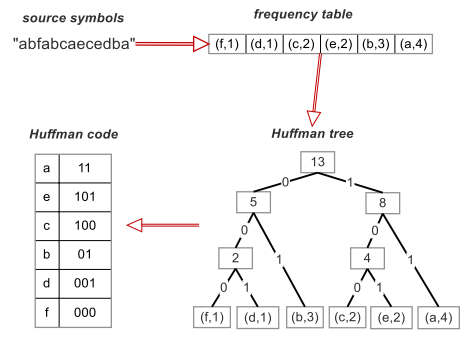

# Project 3

## Project Description: Image Compression with GPU Decompression

Pixel-wise Huffman compression on `.png` images. Modern `.png`  use the DEFALTE algorithm, which is an extension of Huffman encoding and more effective, but for simplicity this project just focuses on using the Huffman algorithm. Essentially, each pixel will be 32bits of information, and this project converts that to a shorter version; usually the longest compressed representation will be 24bits per a highly infrequent RGBA pixel. This is a form of lossless compression, so no data is lost. 

 

_Image Source: Texas A&M (https://cse-robotics.engr.tamu.edu/dshell/cs314/sa6/sa6.html)_

#### Importance 
With modern usage of streaming services and 4k-sized image files, the importance of compressing image/picture data for storage and transfer will yield big benefits in speed and resource usage. Further, utilizing the GPU is a highly efficient medium compared to the CPU for doing heavy workloads, with a modification utilizing GPUs on servers of streaming services could significantly reduce resource usage,  electrical costs, and speed up transportation. The long list of applications could include providing quicker transfer to areas with slow interent speeds.  

### Sequential Compression

Iterate over all pixels and push into a hashmap with key as the color  and value as the frequency of occurrence within the image

```go
  func GetFrequencyMap(img *png.Image) map[color.Color]int {
  	
  	freqmap := make(map[color.Color]int)
  	
  	var currentRGBAValue color.Color
  	
  	bounds := img.In.Bounds()
  	for y := bounds.Min.Y; y < bounds.Max.Y; y++ {
  		for x := bounds.Min.X; x < bounds.Max.X; x++ {
  	
  			currentRGBAValue = img.In.At(x, y)
  	
  			if _, exists := freqmap[currentRGBAValue]; exists {
  				freqmap[currentRGBAValue]++
  			} else {
  				freqmap[currentRGBAValue] = 1
  			}
  		}
  	}
  	return freqmap
  }
```

2. Using a min heap, put the values within a heap. I took an open-sourced minheap from  golangbyexample(https://golangbyexample.com/minheap-in-golang/). Specifically, I modified the value of the heap to hold `ColorNodes` which contained data of the color and references to the parents, right, and left nodes. Finally, construct a Huffman tree by pulling from the minheap until there's only 1 tree node, a sort of "tree forest" aggregation where the trees were originally empty. Each time there's a combination of tree, that new nodes' frequency is the sum of the children. 

```go
   func BuildHuffmanTree(frequencyMap map[color.Color]int) minheap.ColorNode {
   
   	minHeap := minheap.NewMinHeap(len(frequencyMap))
   	
   	for k, v := range frequencyMap {
   		minHeap.Insert(minheap.ColorNode{Frequency: v, ColorValue: k,
   						Parent: nil, Right: nil, Left: nil})
   	}
   	minHeap.BuildMinHeap()
   	
   	for minHeap.Size > 1 {
   		item_one := minHeap.Remove()
   		item_two := minHeap.Remove()
   		
   		combinedFrequency := item_one.Frequency + item_two.Frequency
   		
   		newNode := minheap.ColorNode{Frequency: combinedFrequency, ColorValue: nil,
   						Parent: nil, Right: &item_one, Left: &item_two}
   		item_one.Parent = &newNode
   		item_two.Parent = &newNode
   		
   		minHeap.Insert(newNode)
   	}
   
   	return minHeap.Remove()
   } 
```

3. Encode the picture's pixels and save them in a binary file. Note that the sequential version's codes can be non-standard length (i.e. the code for 'a' could be `00010` and the code for 'b' `01`). Sequentially, this factor does not make a difference in the decompression, but a parallel implementation would 

### Data Compression Results

Since `.png` files already compress their data, we can consider the `<number_of_pixels> * 32bits`, where 32 is 4 bytes representing RGBA. After manual calculations, this programs compressed binary files averaged around 55% the size of the fully uncompressed data files. (note: the huffman map was not included in this clalculation, since building a more robust file format like the `.png` extension would be a large undertaking.) 

For the paralellized version, only 25% compression would be allowed because the task of deciphering an image on multiple workers requires dta alignment--so the huffman codes were moved to a standard of 24 bits each with leading 0's, since the longest code typically was less than 24 but greater than 16. The trade off comes in the form of less compression, with standardized size formats. There'd be a possible solution with a more powerful encoding format, as the data needed to be read as bytes. 

Upon reflection, pixel-wise compression presents challenges in the chunking. If the images were just compressed byte-wise, then that may result in better formatting and improved parallelization. More testing would need to be done to review trade-offs for pixel-wise vs byte-wise compression. 

### Sequential Decompress
Sequential decompression is straight forward using golang map datastructures that stored the corresponding huffman encoding. Open the compressed file and iterate through the code using the Huffman tree structure.

```go
func DecompressFile(huffmanColorMap map[string]color.Color, img *image.RGBA64, compressedLength int){

	f, err := os.Open("out.dat")
	
	if err != nil {
		panic(err)
	}


	output := make([]byte, compressedLength)
	
	binary.Read(f, binary.LittleEndian, &output)
	
	f.Close()
	
	var bitStringBuilder strings.Builder
	
	for _, bits := range output {
		s := fmt.Sprintf("%08b", bits) // careful to keep it of size 8 
		bitStringBuilder.WriteString(s)
	}	
	
	bitString :=  bitStringBuilder.String() 
	
	var tmpStr string
	var currentRGBAValue color.Color
	indx := 0 
	
	bounds := img.Bounds()
	for y := bounds.Min.Y; y < bounds.Max.Y; y++ {
		for x := bounds.Min.X; x < bounds.Max.X; x++ {
	
			tmpStr = ""
			_, exists := huffmanColorMap[tmpStr]
			
			for !exists {
				tmpStr += string(bitString[indx])
				indx++
				_, exists = huffmanColorMap[tmpStr]
			}
			
			currentRGBAValue = huffmanColorMap[tmpStr]
			
			r, g, b, a := currentRGBAValue.RGBA()
			
			img.Set(x, y, color.RGBA64{uint16(r), uint16(g), uint16(b), uint16(a)})
		}		
	}	
	
	png.Save(img, "out.png")
}
```

### GPU Decompression (Advanced Feature)

When assessing the sequentail program for areas of opportunity to utilize the GPU, the slowest component was going through the compressed binary `.bin` data and converting back into the original image. This is where I attempted to utilize the GPU for speedup. Note: due to resource limitations, this code only compiles but requires more work to run--Professor Samuels is aware.   

CUDA does not support anything other than primitaves and pointers to arrays. Working toward pushing binary data and the map to a digestable format for the GPU was a great deal of the work for the project.  

I created my own data structures, where the huffman code is the index for an array and the value at the array is the pixel color--with an array for each pixel. I called these `red_map, green_map,...alpha_map`. 

The output is what the kernel is pushing the image data to. 

```c
/*
	Create an output for the GPU to decompress the data to 
	*/
	unsigned char * output; 
	int pngSize = imageWidth * imageHeight * 4; // 4 bytes for RGBA 
	output = (unsigned char*)malloc(pngSize * sizeof(unsigned char));
	
	// cuda malloc the output for the GPU's to write to 
	// device output
	unsigned char * d_output; 
	cudaMalloc((void**) &d_output, pngSize * sizeof(unsigned char)); 
	
	char * d_data; 
	cudaMalloc((void**) &d_data, size * sizeof(char));; // see binaryfile read that created size variable
	cudaMemcpy((char *) &d_data, data, keyRange * sizeof(unsigned char), cudaMemcpyHostToDevice);
	
	/* copy over the maps to the device/GPU to use 
		 1. declare device maps them on the host with the d_* prefix convention
		 2. cudaMalloc/initiallize them using cudaMalloc
		 3. copy over the data from host to cuda with cudaMemcpy
		 4. pass the device maps to the host
		 5. free the memory on cuda 
	*/
	unsigned char * d_red_map;  
	unsigned char * d_green_map; 
	unsigned char * d_blue_map;  
	unsigned char * d_alpha_map;
	
	cudaMalloc((void**) &d_red_map, keyRange * sizeof(unsigned char));	
	cudaMalloc((void**) &d_green_map, keyRange * sizeof(unsigned char));
	cudaMalloc((void**) &d_blue_map,  keyRange * sizeof(unsigned char));
	cudaMalloc((void**) &d_alpha_map, keyRange * sizeof(unsigned char));
	
	cudaMemcpy((unsigned char *) &d_red_map, red_map, keyRange * sizeof(unsigned char), cudaMemcpyHostToDevice);	
	cudaMemcpy((unsigned char *) &d_green_map, green_map, keyRange * sizeof(unsigned char), cudaMemcpyHostToDevice);
	cudaMemcpy((unsigned char *) &d_blue_map, blue_map, keyRange * sizeof(unsigned char), cudaMemcpyHostToDevice);
	cudaMemcpy((unsigned char *) &d_alpha_map, alpha_map, keyRange * sizeof(unsigned char), cudaMemcpyHostToDevice);
	
	// run the GPU program with N blocks with N threads each
	// will split up the image and then operate on the images with a given index 
	decompress<<<N, N>>>(N, d_data, d_output, imageHeight, imageWidth, d_red_map, d_green_map, d_blue_map, d_alpha_map); 
	
	// copy the data to the cpu/host to the output for the host to export this data to a png file
	cudaMemcpy(d_output, output, pngSize * sizeof(unsigned char), cudaMemcpyDeviceToHost);
	
	cudaFree(d_output);
	cudaFree(d_data);
	cudaFree(d_red_map);
	cudaFree(d_green_map);
	cudaFree(d_blue_map);
	cudaFree(d_alpha_map);
```

The kernel function `decompress(...)` is listed as `__global__` because the host needs to access it and so does the kernel. 

```c
/*
Note this function is global, so that the host can call it. Any subfunctions stemming from this would be __device__ 
and work only within the GPU, but that was not needed

Every input data is an array data structure, and the char is just a byte-sized primitave. 

The indexing comes from the cude kernel itself, which will get the location relative to the image. Then, each thread within the block 
will do a certain amount of work (represneted by the while loop) and populate the output with the uncoding of the data from the 
data array as the key.

In the parellel verison: this essentially will converts 24 bits to 32 bits--since there had to be alignment. 
*/
__global__ void decompress(int n, char * data, unsigned char * output, int height, int width, 
							unsigned char * red_map, unsigned char * green_map, unsigned char * blue_map, unsigned char * alpha_map){

	int index = blockIdx.x * blockDim.x + threadIdx.x;
	int i = 0; 
	while (i <  (int)((height * width) / (n*n)) && index < (height * width)){ // a certain amount of work for each worker. 
		int lookupIndex = data[index + i]; 
		output[index + (5*i) + 0] = red_map[lookupIndex]; 
		output[index + (5*i) + 1] = red_map[lookupIndex]; 
		output[index + (5*i) + 2] = red_map[lookupIndex]; 
		output[index + (5*i) + 3] = red_map[lookupIndex]; 
		i += blockDim.x;  // iterate by the number of threads in a block.  
	}
	__syncthreads(); // wait for all threads to finish. Not needed for calculations but acts like a waiting group
	return; 
}
```

### Running The Program

cd into the `proj3/compression` directory, which houses the golang main function `compressor.go` and all the cuda files. The other directories within `proj3` are helper functions. 

For the cuda, you will need a nvcc compiler and need to adjust the Makefile, which was custom for my PC to point toward my C/C++ compiler. To run, you will need to get an NVCC compiler and compile the program for your PC--thought I pushed the .exe file for proof of compilation, it won't work. I imported special libraries for the Cuda/C png operations and placed them in the `projc3/compression` directory.

The golang files have everything they need from the standard library to run, and/or was included with imports from other folders in `proj3`. 

A command to run it sequentially would be `run compressor.go < test_input.txt` where test_input.txt is a JSON data with a path to the image needing compressed, such as:`{"inPath": "test1.png"}`.
Note: you will need to add a test image for this JSON data to referr to, this github does not contain .png images You can bring in `.png` files from proj2 data dump provided by professor Lamont (https://www.dropbox.com/s/s6sws5w4xcnx94e/proj2_files.zip?dl=0).

Running parallel would require the `-p <threads>` flag where thread > 1, such as `run compressor.go -p 2 < test_input.txt` 

Currently, the program only takes in one JSON request; since the advanced feature component took a greater deal of time--professor Samuels consented to skipping the scripting: but that could be extended into the codebase quickly once a NVIDIA GPU is available.  


For an example you can see in the sequential version on a `go run compressor.go < test_input.txt` command with test_input.txt JSON pointing to test1.png-- and image is created


You can see that the above images are the same out put, and that there was a binary file created called `out.dat` which was read to produce the `out.png`. Notice how the data is larger in `out.dat` than both the `test1.png` and the `out.png`, which is due to the DEFLAT algorithm embedded in PNG--the uncompressed image size would follow this calculation: height* width * bit depth (32) = (4,032 pixels * 3,024 pixels) * 32 bits/pixel = 390,168,576 bits. This is substantailly larger than the `out.dat` file's size of  21,001 KB, or 172,033,280bits, which is roughly half the uncompressed size.  

As a GPU example,  a `map.txt` file would be created and a larget `out.dat` file will be created on a command such as `go run compressor.go -p 10 < test_input.txt`. The bigger size is still smaller, but only by 25% because 24 bit length is enforced to maintain alignment for parallelization. 


### Description of Effort

After carrying over basic components from proj2 such as reading JSON data from an encoder and getting picture data:

First, a great deal of effort was spent figuring out an implementation for Huffman encoding--which is normally described as applying to characters. I implemented my own minheap from an adjusted open-sourced code that could work with linked nodes which started as single nodes. Figuring out how to grow the Huffman tree took a some research and focus. 

Second, reviewing binary files and storing in a consistent filetype. Going through the data and pushing to a single binary file `.dat` or `.bin` and making the file writer work properly with representations across strings and bits. 

Third, further reading the files and getting the data to read back into a png file. Additionally, I had to figure out the best method to call a `.cu` program form a `.go`. I switched techniques form `"c"` library to the `"os/exec"`in Go and just run an already compiled via Makefile executable. 

Fourth, and in parallel thinking, figuring out which component can be parallelized and how to get those data structures to cuda. Figuring out how to compile nvcc on windows. Reading in files, from binary and strings in C/C++.

Fifth, figuring out a C++ library to export images.  This proved trickier than it'd seem, but I found a library `lodePNG` and linked a copy and pasted version of that file. Through Github examples, the `.cu` program and export `.png` files. 

Finally,  writing GPU code on the `.cu` file and getting it to compile. Understanding that all data structures need to be in primitive array/pointer format. A great deal of time was spent organizing the data so that it was acceptable for the GPU via CUDA. 

No speedup is provided, because there was a lack of GPU NVIDIA resources; however the cuda file compiles. Further, the testing would be across different languages and vary greatly. I suggest an exemption from testing at this point given complexity and resource limitations. 

### Learning

I hoped to learn more about Cuda and about compression and cutting edge research. I applied a great deal of data structures throughout and gained a better understanding of moving algorithms to the GPU. Cuda seems a bit more understandable now. Low-level coding in general seems helpful, and I gained an apprecaition for image data and the modern `.png` compression. 

#### Hotspots and Bottlenecks

It's difficult to create a representation of the data using Huffman encoding that's readable via parallelism. Perhaps more sophisticated methods, or a list would work--or keeping the Huffman tree out of a map and as a tree structure. The data needed to be in order, because it was not fully aligned, so I converted it to a single length to run it in the GPU--thus losing size. 

If the program funcionted in a proper GPU, I would imagine the limiting factor would be all the transfering of data. There was transfering of data from golang to `.cu` program, and then transfering the data to the kernel and parsing all the data on the host, as well as pushing and redundant copying for `.png` formatting. Given more time, there could be a more robust solution all within the codebase. 


### Further Work
- Refactor code base and improve exisitng code with more debugging and a standard convention (also peer-review)
- Running on a NVIDIA GPU is critical and testing the speed across a robust data set
- Keep the Huffman tree as a linked list tree, fully thread safe, and use that as the map of the data
- More work on compression algorithm and implementing the DEFLATE algorithm would prove helpful
- Further, work on moving the entire code base to a single language, C/C++, would allow for testing  
- Reviewing and improving the binary storage format and encoding technique
- Look to improve against the benchmark of PNG's DEFLATE algorithm
- Byte-wise compression and other testing of compression
- Review of where else parallel/GPU computing can apply to compression, perhaps with different algorithms
- Running on video or audio data instead of PNG files
- Running on huge filetypes
- Split compression algorithm up differently
- Apply algorithm entirely in GPU kernel 


## Resources

Huffman Algorithm: http://cseweb.ucsd.edu/~kube/cls/100/Lectures/lec9/lec9.html
"The Art of Multiprocessor programming"
https://developer.nvidia.com/blog/easy-introduction-cuda-c-and-c/
NVIDIA forums: https://forums.developer.nvidia.com/
Lode Vandevenne's LodePNG open-sourced code: https://github.com/lvandeve/lodepng

### Libraries
Modified min heap code: https://golangbyexample.com/minheap-in-golang/, found int the minheap directory
lodepng library was added and converted to a cuda in order to export cuda the png files using the nvcc compiler. Those files are `compressor/lodepng.h` and `compressor/lodepng.cu`  
	